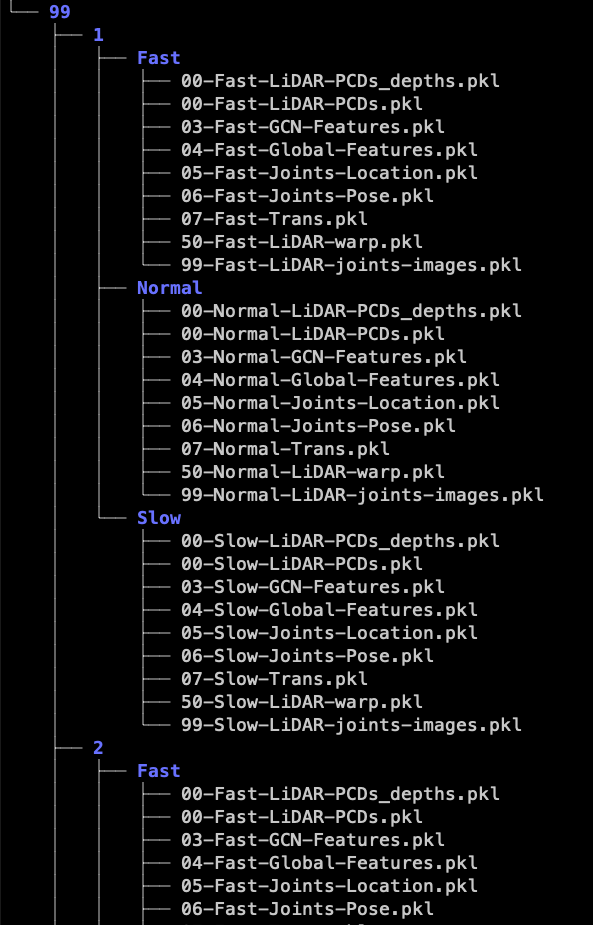

# Tutorial for XMGait

---

## Download the XMGait dataset

Download the dataset from the [link](http://www.cwang93.net:1000/share/YnZ8X9JF)

Decompress these files by following command:

```tar -xzvf xmu_gait.tar```

Then you will get XMGait formatted as:

>identity --> appearance --> walking speed




## Download the checkpoint 

1. Download cat7-25000.pt from [link](http://www.cwang93.net:1000/share/YnZ8X9JF)
2. Put it to `XMUGait/output/Xmu_gait/Baseline/cat7/checkpoints`


# Train/Test the dataset
### Environment
1. clone this repo.
> git clone https://github.com/jingyi-zhang/XMGait.git

2. install dependenices
> pip install torch==1.10.1+cu113 torchvision==0.11.2+cu113 -f https://download.pytorch.org/whl/torch_stable.html \
> pip install -r requirements.txt

3. ```cd XMUGait```
- Modify the `dataset_root` in `config/lidargait/lidargait_xmu.yaml`
- **Train**:
`CUDA_VISIBLE_DEVICES=xx python -m torch.distributed.launch --nproc_per_node=xx --master_port xx opengait/main.py --cfgs config/lidargait/lidargait_xmu.yaml --phase train`
- **Test**:
`CUDA_VISIBLE_DEVICES=xx python -m torch.distributed.launch --nproc_per_node=xx --master_port xx opengait/main.py --cfgs config/lidargait/lidargait_xmu.yaml --phase test`

# Dataset process
Note: You can use these code to process your own data.  For XMGait, we recommend using our provided projected depth map and deformable scene flow for convenience.
### Projected depth map generate
- ```cd XMUGait/datasets & python point2depth.py```
  
### Deformable scene flow generate
- ```cd XMUGait/datasets & python point2deformable.py```
  
# Acknowledgement
This project is not possible without multiple great opensourced codebases. We list them below:

[OpenGait](https://github.com/ShiqiYu/OpenGait)
> @InProceedings{Fan_2023_CVPR,\
    author    = {Fan, Chao and Liang, Junhao and Shen, Chuanfu and Hou, Saihui and Huang, Yongzhen and Yu, Shiqi},\
    title     = {OpenGait: Revisiting Gait Recognition Towards Better Practicality},\
    booktitle = {Proceedings of the IEEE/CVF Conference on Computer Vision and Pattern Recognition (CVPR)},\
    month     = {June},\
    year      = {2023},\
    pages     = {9707-9716}\
}

[LiDARCap](https://github.com/jingyi-zhang/LiDARCap.git)
> @inproceedings{li2022lidarcap,\
  title={Lidarcap: Long-range marker-less 3d human motion capture with lidar point clouds},\
  author={Li, Jialian and Zhang, Jingyi and Wang, Zhiyong and Shen, Siqi and Wen, Chenglu and Ma, Yuexin and Xu, Lan and Yu, Jingyi and Wang, Cheng},\
  booktitle={Proceedings of the IEEE/CVF conference on computer vision and pattern recognition},\
  pages={20502--20512},\
  year={2022}\
}
